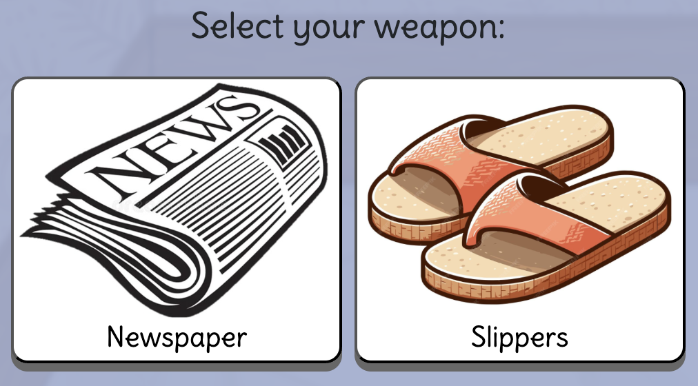

# Whack-a-*Ka-Tsoa*

A cute but chaotic browser-based game where you smash *ka-tsoas* (cockroaches) with either a newspaper or slippers (Singaporean's favourite weapons)!  
Choose your weapon, select your game mode, and see how many pests you can eliminate before time runs out (or before one gets you first 😱)!  
 Unleash your anger and take revenge on the *ka-tsoas*!

## 🎮 Game Modes

- **React Mode:** A single *ka-tsoa* spawns at random time range between 0 to 10seconds and moves quickly. You only get ___one shot___, click too early or too late, and it’s game over.
- **Rhythm Mode:** *Ka-tsoas* spawn rapidly in different lanes for 30 seconds. Rack up as many kills as possible!
- **Tutorial Mode:** Same as React mode, but with slower spawn speed and indefinite time while the spawn stays and lets you catch it.  

> Pro tip: Use mouse instead of mousepad to hit.

## 🧰 Features

- 👞 Choose your weapon: **Newspaper** or **Slippers**  

- ⏱️ Timer-based scoring in Hard mode
- 😵 Funny win/lose scenarios and popups
- 🧠 Memorize the *ka-tsoa* paths and act fast!
- 💅 Custom fonts, animations, and styling
- 📱 Fixed resolution: Game won’t shrink if browser size changes (preferred 1200 x 750 px)

## 🕹️ Controls

- **Mouse Click:** Whack the *ka-tsoas*
- **Mouse Movement:** Weapon follows cursor (aim via center of weapon only)
- **Restart Button:** Replay from difficulty selection
- **Start over Button:** Reselect from player name input

## 🖼️ Tech Stack

- HTML5
- CSS3 (with custom keyframe animations)
- JavaScript (Vanilla)

## 🚀 How to Play

1. Open the game in your browser.
2. Enter your player name.
3. Choose your difficulty mode.
4. Pick your weapon.
5. Smash as many *ka-tsoas* as you can!

## 👩🏻‍💻 Author

**Madeline Lim**  
Built with love, chaos, and lots of "EW!" moments.

Feel free to adapt or add GIFs/screenshots if you're posting it online!
